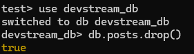
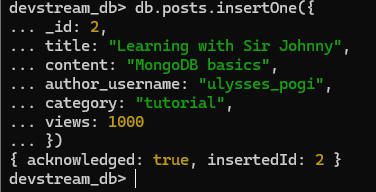
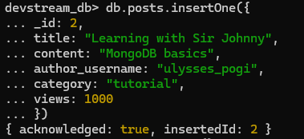
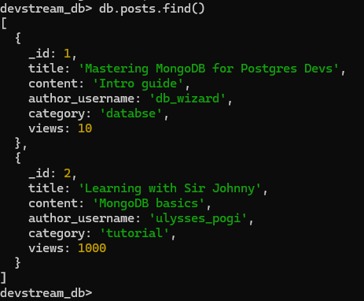
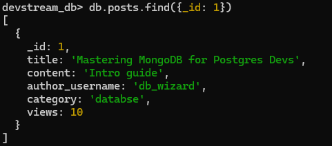
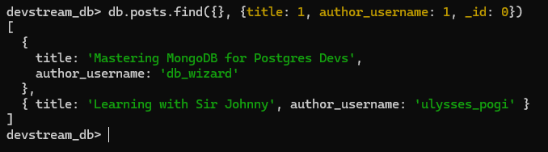
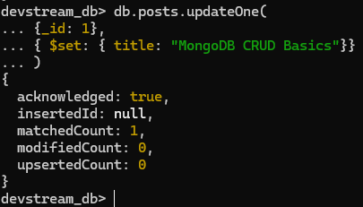
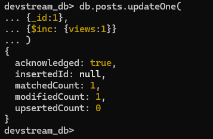
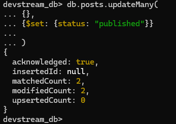
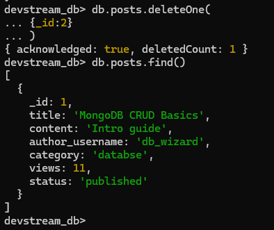

# Activity 10 Solution


## Part 1: Quick Mapping (Postgres -> MongoDB)

| PostgreSQL | MongoDB Equivalent |
|---|---|
| `INSERT INTO posts ...` |`db.posts.insertOne({title: "...", content: "..."})`  |
| `SELECT * FROM posts WHERE title='...'` | `db.posts.find({title: "..."})` |
| `UPDATE posts SET title='...' WHERE id=...` | `db.posts.updateOne({_id: ...}, {$set: {title: "..."}})` |
| `DELETE FROM posts WHERE id=...` | `db.posts.deleteOne({_id: ...})` |

## Part 2: Hands-on CRUD in MongoDB

```mongo
use devstream_db
db.posts.drop()
```
Screenshot(s):


### 2.1 Setup

Commands:
```javascript
devstream_db> db.posts.insertOne({
... _id: 2,
... title: "Learning with Sir Johnny",
... content: "MongoDB basics",
... author_username: "ulysses_pogi",
... category: "tutorial",
... views: 1000
... })
```

Screenshot(s):



### 2.2 Create

Commands:

```javascript
devstream_db> db.posts.insertOne({
... _id: 2,
... title: "Learning with Sir Johnny",
... content: "MongoDB basics",
... author_username: "ulysses_pogi",
... category: "tutorial",
... views: 1000
... })
```

Screenshot(s):



### 2.3 Read

Commands:

```javascript
db.posts.find()

db.posts.find(
... { _id: 1 }
... )

db.posts.find(
... {}, 
... {title: 1, author_username: 1, _id: 0}
...)
```

Screenshot(s):





### 2.4 Update

Commands:

```javascript
db.posts.updateOne(
... {_id: 1},
... { $set: { title: "MongoDB CRUD Basics"}}
... )

db.posts.updateOne(
... {_id:1},
... {$inc: {views:1}}
... )

db.posts.updateMany(
... {},
... {$set: {status: "published"}}
...
... )
```

Screenshot(s):





### 2.5 Delete

Commands:

```javascript
db.posts.deleteOne(
... {_id:2}
... )
```

Screenshot(s):


## Part 3: Reflection (3-4 sentences)

1. One thing that feels easier in MongoDB CRUD:

    - One thing that feels easier in MongoDB is inserting data. It uses a JSON-like format, which makes it simple to write and understand. I also noticed that we do not need to define a strict table structure before adding data.

2. One thing that was clearer in PostgreSQL CRUD:

    - PostgreSQL CRUD felt clearer to me because the table structure is already defined. The columns help me understand what kind of data should be stored. This makes the database more organized and easier to follow.