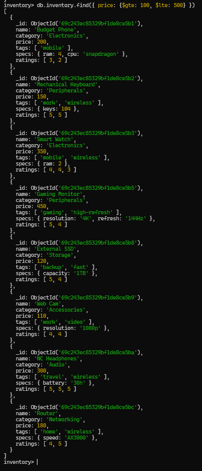
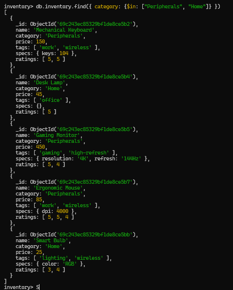
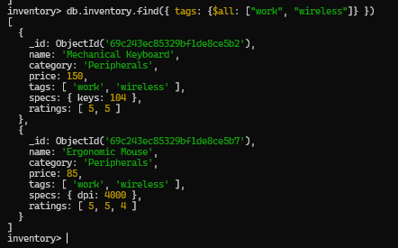
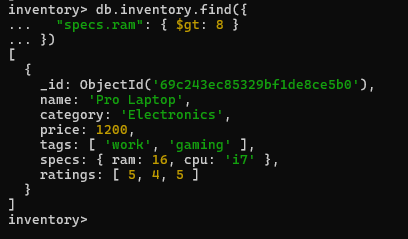
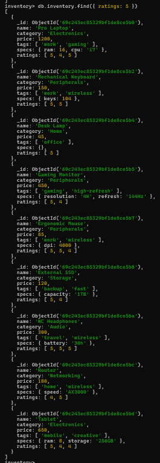

# Activity 11: SQL to MongoDB & Advanced Querying - Answer Template

## Part 1: Relational to Document Modeling

### 1. Proposed JSON Schema (`posts` collection)
```json
// Provide your single document structure here
{
  "_id": "...",
  "title": "...",
  "body": "...",
  "created_at": "...",
  "author": {
    // Decide: Embed or Reference?
  },
  "tags": [
    // Decide: Embed or Reference?
  ]
}
```

### 2. Strategic Choices
*   **Tags:** - Embed
*   **Author:** - Embed

### 3. Justification
> Embedding tags improves performance because they are small and always accessed with posts, avoiding extra queries. Embedding author data also speeds up retrieval since it is typically displayed with posts. Although this causes some duplication, infrequent updates make it acceptable.

---

## Part 2: Querying with MQL Operators

```javascript
DATASET
db.inventory.insertMany([
  {
    name: "Pro Laptop",
    category: "Electronics",
    price: 1200,
    tags: ["work", "gaming"],
    specs: { ram: 16, cpu: "i7" },
    ratings: [5, 4, 5]
  },
  {
    name: "Budget Phone",
    category: "Electronics",
    price: 200,
    tags: ["mobile"],
    specs: { ram: 4, cpu: "snapdragon" },
    ratings: [3, 2]
  },
  {
    name: "Mechanical Keyboard",
    category: "Peripherals",
    price: 150,
    tags: ["work", "wireless"],
    specs: { keys: 104 },
    ratings: [5, 5]
  },
  {
    name: "Smart Watch",
    category: "Electronics",
    price: 350,
    tags: ["mobile", "wireless"],
    specs: { ram: 2 },
    ratings: [4, 4, 3]
  },
  {
    name: "Desk Lamp",
    category: "Home",
    price: 45,
    tags: ["office"],
    specs: {},
    ratings: [5]
  },
  {
    name: "Gaming Monitor",
    category: "Peripherals",
    price: 450,
    tags: ["gaming", "high-refresh"],
    specs: { resolution: "4K", refresh: "144Hz" },
    ratings: [5, 4]
  },
  {
    name: "USB-C Hub",
    category: "Accessories",
    price: 60,
    tags: ["work", "connectivity"],
    specs: { ports: 7 },
    ratings: [4, 3, 4]
  },
  {
    name: "Ergonomic Mouse",
    category: "Peripherals",
    price: 85,
    tags: ["work", "wireless"],
    specs: { dpi: 4000 },
    ratings: [5, 5, 4]
  },
  {
    name: "External SSD",
    category: "Storage",
    price: 120,
    tags: ["backup", "fast"],
    specs: { capacity: "1TB" },
    ratings: [5, 4]
  },
  {
    name: "Web Cam",
    category: "Accessories",
    price: 110,
    tags: ["work", "video"],
    specs: { resolution: "1080p" },
    ratings: [4, 4]
  },
  {
    name: "NC Headphones",
    category: "Audio",
    price: 300,
    tags: ["travel", "wireless"],
    specs: { battery: "30h" },
    ratings: [5, 5, 5]
  },
  {
    name: "Smart Bulb",
    category: "Home",
    price: 25,
    tags: ["lighting", "wireless"],
    specs: { color: "RGB" },
    ratings: [3, 4]
  },
  {
    name: "Router",
    category: "Networking",
    price: 180,
    tags: ["home", "wireless"],
    specs: { speed: "AX3000" },
    ratings: [4, 5]
  },
  {
    name: "Tablet",
    category: "Electronics",
    price: 650,
    tags: ["mobile", "creative"],
    specs: { ram: 8, storage: "256GB" },
    ratings: [5, 4, 4]
  },
  {
    name: "BT Speaker",
    category: "Audio",
    price: 90,
    tags: ["outdoor", "wireless"],
    specs: { waterproof: "IPX7" },
    ratings: [4, 4]
  }
])
```

### 1. Price Range
*Find all items priced between $100 and $500 (inclusive).*


```javascript
db.inventory.find({ price: {$gte: 100, $lte: 500}})
```

### 2. Category Match
*Find all items that are in either the "Peripherals" or "Home" categories.*


```javascript
db.inventory.find({ category: {$in: ["Peripherals", "Home"]} })
```

### 3. Tag Power
*Find all items that have **both** the "work" AND "wireless" tags.*


```javascript
db.inventory.find({ tags: {$all: ["work", "wireless"]} })
```

### 4. Nested Check
*Find all items where the `specs.ram` is greater than 8GB.*


```javascript
db.inventory.find({ "specs.ram": {$gte: 8} })
```

### 5. High Ratings
*Find all items that have at least one `5` in their `ratings` array.*


```javascript
db.inventory.find({ ratings: 5 })
```
