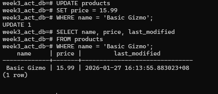

# Lab Activity: Implementing an Audit Trail with Triggers
Create a PL/pgSQL function named log_product_changes() that returns type TRIGGER. This function will contain the logic for handling the different event types.

---

# Bonus Challenges
Bonus Challenge: Automatically Update last_modified

