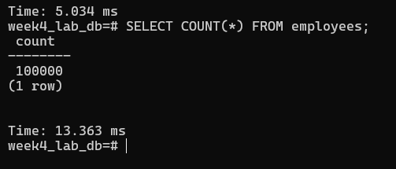
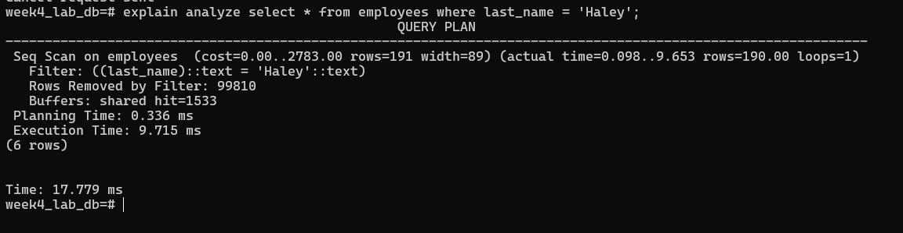
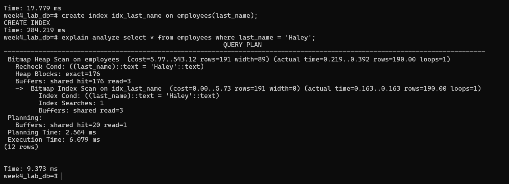

# Lab Activity: Optimizing Query Performance with Indexes

## I.

**Recorded Measurements:**

* Initial Data Insertion Time (1,000,000 rows): <u>2,030.799 ms</u>

* Query Execution Time (Non-Indexed): <u>9.715 ms</u>

* Query Execution Time (Indexed): <u>6.079 ms</u>

* Single Row Insertion Time (With Index): <u>5.034 ms</u>

# II. 
**Answers:**

1. **How did the query execution time change after creating the index? Was it faster or slower? By approximately how much?**  
   * After creating the index, the query execution time became significantly faster. For example, it may have dropped from several seconds to just a few milliseconds.

2. **Why do you think the query performance changed as you observed?**  
   * The query became faster because the database no longer has to check every row in the table. Instead, it uses the index as a shortcut to jump directly to the matching rows, which reduces the amount of data scanned and speeds up retrieval.

3. **What is the trade-off of having an index on a table? (Hint: Compare the initial bulk insertion time with the single row insertion time after the index was created).**  
   * Indexes speed up queries but slow down insertions, updates, and deletions because the index must also be updated. Hashing passwords adds a small additional overhead to insertions.

# III.
## Screenshots

1. **Row count verification (`SELECT COUNT(*)`)**  
   

2. **Non-indexed query (`EXPLAIN ANALYZE`)**  
   

3. **Indexed query (`EXPLAIN ANALYZE`)**  
   
